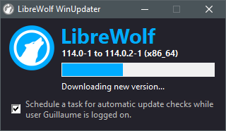

# LibreWolf WinUpdater
by ltGuillaume: [Codeberg](https://codeberg.org/ltGuillaume) | [GitHub](https://github.com/ltGuillaume) | [Buy me a beer](https://buymeacoff.ee/ltGuillaume) 🍺

An attempt to make updating LibreWolf for Windows much easier.

## Getting started
- If you want to run the portable version of LibreWolf, download and extract [`librewolf-xx.x.en-US.win64.portable.zip`](https://gitlab.com/librewolf-community/browser/windows/-/releases). It already contains a compiled version of the project hosted here.  
  WinUpdater will automatically update LibreWolf whenever you run `LibreWolf-Portable.exe` (checking for a new version once a day).  
- If you have installed LibreWolf, then download and extract the latest [`LibreWolf-WinUpdater_x.x.x.zip`](https://github.com/ltGuillaume/LibreWolf-WinUpdater/releases) to a folder you like, e.g. `%AppData%\LibreWolf`. Run `LibreWolf-WinUpdater.exe` to check for an update. If one is available, it will be downloaded and installed immediately.  
  If LibreWolf is running, the updater will notify you of the new version and start the update as soon as you close the browser. The last result can be found in `LibreWolf-WinUpdater.ini`.  

## Scheduled updates
- You can right-click on `ScheduledTask-Create.ps1` and choose `Run with PowerShell` to create a scheduled task (for the current user account) that checks for updates every 4 hours, and at logon.  
  When run from a scheduled task, _error_ messages will only be saved in  `LibreWolf-WinUpdater.ini` (no dialogs will be shown).  
  The updater will now run as administrator, so the installer can be run silently.  
  __Warning__: In order to run PowerShell scripts, the Execution Policy should set to at least _RemoteSigned_ (`Set-ExecutionPolicy RemoteSigned`). The included scripts try to automatically do that. You can reset this policy in an elevated PowerShell window by typing `Set-ExecutionPolicy Default` and `Y`.
- You can remove the scheduled task by right-clicking on `ScheduledTask-Remove.ps1` and choosing `Run with PowerShell`.

## Remarks
- If you're having issues with the updater on __Windows 7__, please have a look at [these instructions](https://github.com/ltGuillaume/LibreWolf-WinUpdater/issues/15).
- The updater needs to be able to write to `LibreWolf-WinUpdater.ini` in its own folder, so make sure it has permission to do so.
- The ini-file contains a `[Log]` section that shows the last update check's result and the last update action.

## Credits
* [LibreWolf](https://librewolf.net) by [ohfp](https://gitlab.com/ohfp), [stanzabird](https://stanzabird.nl), [fxbrit](https://gitlab.com/fxbrit), [maltejur](https://gitlab.com/maltejur), [bgstack15](https://bgstack15.wordpress.com) et al.
* Original icon by the [LibreWolf Community](https://gitlab.com/librewolf-community/branding/-/tree/master/icon)
