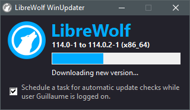

# LibreWolf WinUpdater
by ltGuillaume: [Codeberg](https://codeberg.org/ltguillaume) | [GitHub](https://github.com/ltguillaume) | [Buy me a beer](https://coff.ee/ltguillaume) 🍺

An attempt to make updating LibreWolf for Windows much easier.



## Getting started
### LibreWolf Setup
- When installing LibreWolf, the [official installer](https://librewolf.net/installation/windows/) will show an option to install LibreWolf WinUpdater. On first run, it will copy itself to `%AppData%\LibreWolf\WinUpdater` to be able to update itself without administrator privileges.
- Alternatively, you can download and extract the latest [`LibreWolf-WinUpdater_x.x.x.zip`](https://codeberg.org/librewolf/winupdater/releases), then run `LibreWolf-WinUpdater.exe` to check for an update. If one is available, it will be downloaded immediately.
### LibreWolf Portable
- If you want to run the portable version of LibreWolf, download and extract [`librewolf-xxx.x.x-windows-x86_64-portable.zip`](https://librewolf.net/installation/windows/) (second blue button). It already contains WinUpdater.
- LibreWolf will be updated automatically whenever you run `LibreWolf-Portable.exe` (checks for new versions happen once a day). If you only wish to perform update checks manually, just rename WinUpdater to e.g. `LibreWolf-ManualUpdater.exe` and run it whenever you like.
### Scheduled updates
- When __installing LibreWolf__, select the option `Schedule Automatic Updates` to automatically set up what's described in the point below.
- You can run LibreWolf WinUpdater to enable the option `Schedule a task for automatic update checks`. This will prompt for administrator permissions and a blue (PowerShell) window will notify you of the result. The scheduled task will run while the __current user account__ is logged in (at 1 minute after login, and every 4 hours).
- If your account has __administrator permissions__, the update will be fully automatic. If not, the update will be downloaded and you will be asked to start the update (administrator permissions required).
- If LibreWolf is already __running__, you will be notified about the new version. The update will start as soon as you close the browser.

## Settings
### Settings and log file
- The updater needs to be able to write to `LibreWolf-WinUpdater.ini` in its own folder (so make sure it has permission to do so), otherwise WinUpdater will copy itself to `%AppData%\LibreWolf\WinUpdater` and run from there.
- `LibreWolf-WinUpdater.ini` contains a `[Log]` section that shows the results of the last update check and the last update action.
### Self-updating
LibreWolf WinUpdater also updates itself automatically, so you won't have to check for new releases on this page. However, if you prefer to update it manually, you can set `UpdateSelf` to `0` in the .ini file under `[Settings]`:
```ini
[Settings]
UpdateSelf=0
```
### Changing the working directory
If for some reason WinUpdater is not able to use the user's default `%Temp%` folder for downloading and extracting files, you can specify an alternative work directory by setting `WorkDir` in the .ini file under `[Settings]`:
```ini
[Settings]
WorkDir=D:\Temp
```
To specify the directory of `LibreWolf-WinUpdater.exe`, use `WorkDir=.`, or use a relative subfolder like `WorkDir=.\Temp`.

## Issues
### Anti-cheat software
If you set up scheduled updates, you might get annoyed by some anti-cheat software. It may wrongfully point at WinUpdater, because it is built upon AutoHotkey, which _can_ be used to cheat in games. If this happens, you can either:
  1. Open the __Task Scheduler__ via the Start menu, then double-click on `LibreWolf WinUpdater...` in the `Task Scheduler Library`, open the `Triggers` tab, then click on `One time` and the button `Delete`. Then press `OK` to make the change to _only check for updates 1 minute after login_ (and not every 4 hours). This will still cause issues if you leave games opened when locking your user account, though.
  2. Create a shortcut to `%AppData%\LibreWolf\WinUpdater\LibreWolf-Winupdater.exe /RemoveTask` and one to `%AppData%\LibreWolf\WinUpdater\LibreWolf-Winupdater.exe /CreateTask` (on your desktop), so you can quickly prevent WinUpdater from running during gameplay and reactivate it afterwards. Just put them next to the shortcuts of your game launchers and you won't forget.
### Signature verification
WinUpdater will validate itself and the setup file (or `librewolf.exe` when downloading the portable version) via the signing certificate. For this, PowerShell is used in the background. You may get the warning `Could not verify that (...) was correctly signed` or the error `Signature verification has failed` if you have blocked internet access for PowerShell (e.g. `%WinDir%\SysWOW64\WindowsPowerShell\v1.0\powershell.exe`). For signature verification, PowerShell needs to be able to update certificate revocation lists. If this is not possible on your system, you can permanently disable signature checks and rely on the file hash checks exclusively by setting `NoSigChecks` to `1` in the .ini file under `[Settings]`:
```ini
[Settings]
NoSigChecks=1
```
### Server certificate revocation
You may encounter a `Security Alert: Revocation information for the Security certificate for this site is not available` Windows dialog or a `The server certificate revocation check for (...) has failed` warning by WinUpdater. This can happen if you have enabled the non-default option `Check for server certificate revocation` in the Windows `Internet Options` (tab `Advanced`). You can tell WinUpdater to automatically continue when this dialog pops up by setting `IgnoreCrlErrors` to `1` in the .ini file under `[Settings]`:
```ini
[Settings]
IgnoreCrlErrors=1
```

## Credits
* [LibreWolf](https://librewolf.net) by the [LibreWolf Community](https://librewolf.net/#core-contributors)
* [Original icon](https://codeberg.org/librewolf/branding) by the [LibreWolf Community](https://librewolf.net/#core-contributors)
